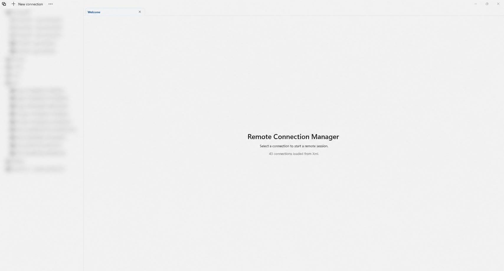

# Loipv Remote

**Loipv Remote** is a focused Windows remote-connection manager for teams that need a fast, tidy place to open and organize SSH and RDP sessions.



> The connection list in this screenshot is intentionally blurred. Do not include production hosts, usernames, passwords, or other credentials in issues, screenshots, or exported documentation.

## Why Loipv Remote

- Keep RDP and SSH connections in one folder tree.
- Open each remote session in its own tab without losing the rest of your workspace.
- Use native Windows RDP and PuTTY-backed SSH sessions embedded in the application.
- Create, edit, duplicate, move, import, and export connections from the UI.
- Store local saved secrets protected for the current Windows user.
- Export a portable XML package with usernames and passwords when you deliberately need to move connections to another machine.

## RDP that fits the workspace

RDP sessions start at the size of their tab rather than a fixed desktop resolution. The client uses DPI-aware sizing, keeps the remote session within a practical range of **1024×768 to 3840×2160**, and updates the desktop after the window resize has settled. If dynamic resolution is unavailable on a server, SmartSizing remains enabled as the fallback.

## Installation

Download the matching installer from the [GitHub Releases](../../releases) page:

- `LoipvRemote-Installer-x64.msi` for most Intel/AMD Windows PCs.
- `LoipvRemote-Installer-arm64.msi` for Windows on ARM.

The installer is self-contained and includes the required Windows App SDK runtime.

## Using the app

1. Choose **New connection** and select SSH or RDP.
2. Enter the host, port, and credentials, then save it in a folder.
3. Select a connection to open its tab and start the remote session.
4. Right-click a connection or folder for edit, duplicate, move, delete, and import/export actions.

### Import and export

The **Export XML** action creates a portable file that includes connection settings, usernames, and passwords so another Loipv Remote installation can import it and connect immediately.

Treat exported XML as a secret: store it securely, share it only through an approved channel, and delete it when it is no longer needed. Normal local storage remains protected for the current Windows user.

## Build from source

Requirements:

- Windows 10 version 2004 or later, or Windows 11
- .NET SDK version specified in [global.json](global.json)
- WiX tooling restored by the installer project

```powershell
dotnet restore LoipvRemote.slnx
dotnet test LoipvRemote.WinUI.Tests/LoipvRemote.WinUI.Tests.csproj -c Release -p:Platform=x64
dotnet build LoipvRemoteInstaller/Installer/Installer.wixproj -c Release -p:Platform=x64
```

The x64 installer is written to `LoipvRemoteInstaller/Installer/bin/x64/Release/`.

## Project status

Loipv Remote is a Windows desktop application. Contributions are welcome through issues and pull requests, provided that no production connection details or credentials are included.

## License

Licensed under the [GNU GPL v2](COPYING.txt).
